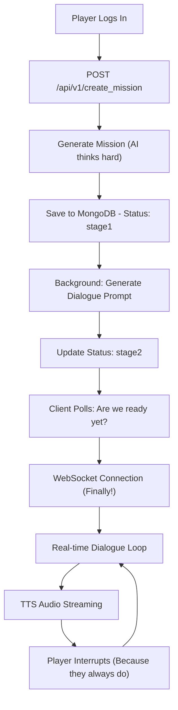

# Radio Mirchi Backend

The brain behind the [retro radio propaganda infiltration game](https://github.com/akshit2434/radio_mirchi). This is where the magic happens - AI generates convincing radio hosts, streams real-time dialogue, and tracks whether you're actually waking people up or just annoying them.

##  What This Thing Actually Does

So you want to know how we made AI generate propaganda and then let players fight it in real-time? Here's the deal:

- **Mission Generation**: Creates unique radio show scenarios (each one feels different, we promise)
- **Real-time Dialogue**: Streams AI conversations with actual voice (not robot voice!)
- **Player Interaction**: Handles when you inevitably interrupt the AI mid-sentence
- **Persuasion Tracking**: Keeps score of how many listeners you're "awakening" (spoiler: it's harder than it looks)
- **Voice Processing**: Understands what you're saying and responds back

## The Flow That Actually Works



## 🛠️ The Tech Stack (Or: What we Used So You Don't Have To)

### Core Framework
- **FastAPI** - Because I like my APIs fast and my code typed
- **Pydantic** - Structured data that doesn't make me cry
- **Motor** - Async MongoDB driver (no more "why is everything blocking?!")

### AI & Audio Magic
- **Google Gemini 2.5 Flash** - The AI that actually creates convincing propaganda
- **Deepgram SDK** - TTS/STT that doesn't sound like it's from 1995
- **WebSockets** - Real-time communication that usually works

### Data & Deployment
- **MongoDB** - Stores all the mission data and player chaos

## 🚀 Getting This Running

### You'll Need
- Python 3.8+ 
- MongoDB instance (local or cloud, your choice)
- Google Gemini API key 
- Deepgram API key

### Installation (The Easy Part)
```bash
# Grab the code
git clone https://github.com/akshit2434/radio_mirchi_backend.git
cd radio_mirchi_backend

# Set up your environment (please use virtual environments)
python -m venv venv
source venv/bin/activate  # Windows folks: venv\Scripts\activate

# Install everything
pip install -r requirements.txt

# Set up your secrets
cp env.example .env
# Edit .env with your actual API keys (don't commit this file!)
```

### Your Secret Variables
```env
# MongoDB (local or Atlas, whatever works)
MONGODB_URI=mongodb://localhost:27017/radio_mirchi

# Google Gemini (this is where the magic happens)
GOOGLE_API_KEY=your_gemini_api_key_here

# Deepgram (for voice that doesn't suck)
DEEPGRAM_API_KEY=your_deepgram_api_key_here

# Server settings
HOST=0.0.0.0
PORT=8000
DEBUG=true
```

### Fire It Up
```bash
# Development (with auto-reload because I'm impatient)
uvicorn app.main:app --reload --host 0.0.0.0 --port 8000

# Production (when you're ready for the world)
uvicorn app.main:app --host 0.0.0.0 --port 8000
```

## 🎮 How This Actually Works

### Phase 1: Setting Up the Mission (The Boring but Important Part)
When someone hits "start mission":

1. **AI Generates the Scenario** - Gemini creates a unique radio show setup
2. **Characters Come to Life** - Each AI host gets personality traits and backstory
3. **Listener Count Set** - How many people you need to "wake up"
4. **Everything Gets Saved** - MongoDB stores it all with `status: "stage1"`
5. **Background Magic Happens** - Server generates the dialogue prompt for phase 2

### Phase 2: The Real-Time Chaos (The Fun Part)
Once everything's ready:

1. **WebSocket Opens** - Direct line between player and AI
2. **Game Session Starts** - Manages the conversation flow
3. **AI Talks** - Generates dialogue in batches (because real-time generation is hard)
4. **Voice Streaming** - TTS sends audio chunks as they're generated
5. **Player Interrupts** - System pauses, processes what you said, continues
6. **Score Updates** - Tracks how well you're doing at changing minds

## 📝 License
MIT License - do whatever you want with it, just don't blame us when it breaks.
